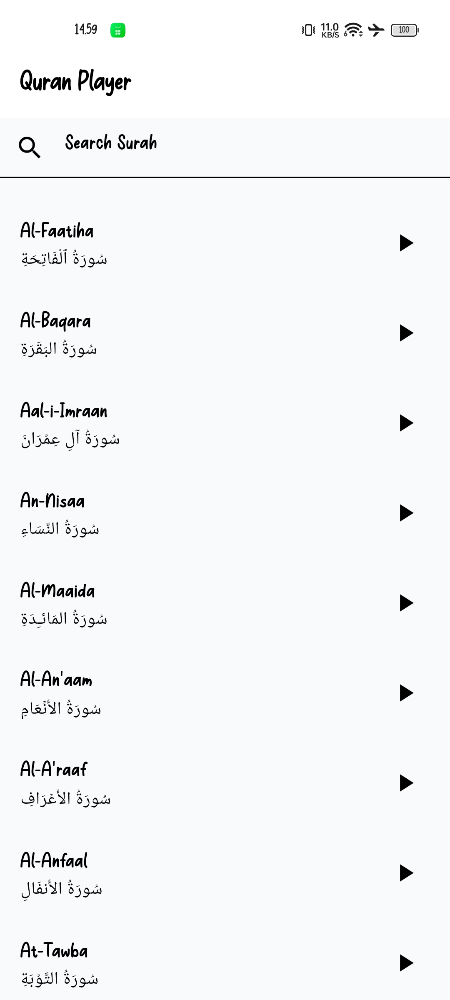
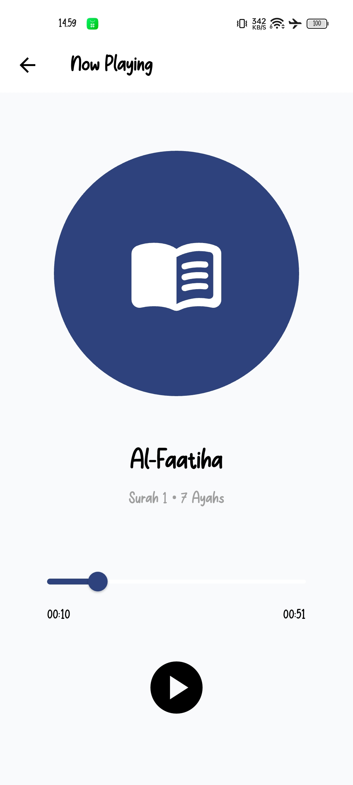

# Quran Player

A Flutter application that allows users to search Quran surahs and play Quran recitations using the AlQuran Cloud API.

## Features

### Search Surah

* Search surahs by Arabic name or English name.
* Real-time filtering while typing.

### Audio Playback

* Play Quran recitation audio.
* Pause audio playback.
* Resume audio playback.

### Audio Progress

* Display current playback position.
* Display total audio duration.
* Real-time progress updates.

### Seeking

* Navigate to any position within the audio using a slider.

### Theme Support

* Light Mode
* Dark Mode

### State Management

* Implemented using BLoC pattern.

---

## Screenshots

### Home Screen



### Player Screen



---

## Tech Stack

### Framework

* Flutter

### State Management

* flutter_bloc

### Networking

* dio

### Routing

* go_router

### Audio Playback

* just_audio

### Utilities

* equatable

---

## Project Structure

```text
lib/
├── app/
│   ├── router/
│   └── theme/
│
├── core/
│   ├── constants/
│   ├── extensions/
│   ├── network/
│   ├── services/
│   └── widgets/
│
├── features/
│   └── quran_player/
│       ├── data/
│       │   ├── datasource/
│       │   ├── models/
│       │   └── repositories/
│       │
│       ├── domain/
│       │   ├── entities/
│       │   └── repositories/
│       │
│       └── presentation/
│           ├── bloc/
│           ├── pages/
│           └── widgets/
│
└── main.dart
```

---

## Architecture

This project follows a simplified Clean Architecture approach.

### Data Layer

Responsible for:

* API communication
* JSON parsing
* Repository implementation

### Domain Layer

Responsible for:

* Business entities
* Repository contracts

### Presentation Layer

Responsible for:

* UI rendering
* User interactions
* State management using BLoC

---

## API Source

This application uses the public API provided by AlQuran Cloud.

API Documentation:

https://alquran.cloud/api

---

## Getting Started

### Prerequisites

* Flutter SDK
* Dart SDK
* Android Studio or VS Code
* Git

### Clone Repository

```bash
git clone https://github.com/Guntursap/quran-player.git
```

### Navigate to Project

```bash
cd quran-player
```

### Install Dependencies

```bash
flutter pub get
```

### Run Application

```bash
flutter run
```

---

## Build APK

```bash
flutter build apk --release
```

Generated APK:

```text
build/app/outputs/flutter-apk/app-release.apk
```

---

## Code Quality

The project follows:

* Feature-based folder structure
* Clean Architecture principles
* BLoC state management
* Separation of concerns
* Reusable widgets
* Consistent naming conventions

---

## Future Improvements

* Full Surah playlist support
* Download audio for offline playback
* Favorite surahs
* Local persistence using SharedPreferences or Hive
* Unit testing and widget testing
* Background audio playback
* Notification controls

---

## Author

**Guntur Saputra**

GitHub: https://github.com/Guntursap

Thank you for reviewing this project.
